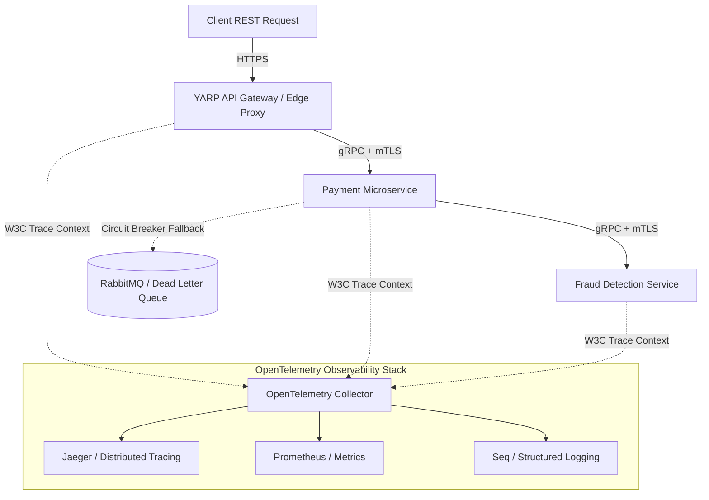

# Nexus.ZeroTrust.PaymentGateway

Dağıtık bir .NET mimarisinde, servisler arası iletişimin mTLS ile şifrelendiği (Zero-Trust), OpenTelemetry ile uçtan uca izlenebildiği (Observability) ve Polly/DLQ stratejileriyle hatalara karşı dirençli (Resilient) hale getirildiği "Global Payment Gateway" referans mimarisi.

## Core Architectural Concepts

Bu proje, mikroservis mimarilerinde sıkça yaşanan "domino etkisiyle çökme" (Cascading Failures) ve "kayıp istekler" (Lost Traces) sorunlarına kurumsal çözümler getirmek amacıyla tasarlanmıştır.

1.  **Zero-Trust İletişimi:** Servisler birbirine doğrudan güvenmez. YARP (Gateway) ve arka plandaki tüm mikroservisler arası iletişim gRPC üzerinden ve mTLS (Mutual TLS) sertifikaları ile şifrelenerek gerçekleşir.
2.  **Distributed Context Propagation:** Sisteme giren her HTTP isteğine YARP tarafından benzersiz bir `TraceId` atanır. Bu kimlik, gRPC kanalları üzerinden tüm alt servislere taşınır ve hata anında logların tekilleştirilmesini sağlar.
3.  **Resilience & Dead Letter Queue (DLQ):** Alt servislerde (örn. Dolandırıcılık Kontrolü) yaşanacak kesintilerde Polly Circuit Breaker devreye girer. İşlenemeyen kritik ödeme mesajları kaybolmamak üzere RabbitMQ üzerindeki Dead Letter Queue'ya aktarılır.

## System Architecture & Data Flow

Aşağıdaki şema, dış dünyadan gelen bir isteğin sistem içinde nasıl güvenli bir şekilde yönlendirildiğini ve izlenebilirlik (Observability) katmanına nasıl raporlandığını göstermektedir.

